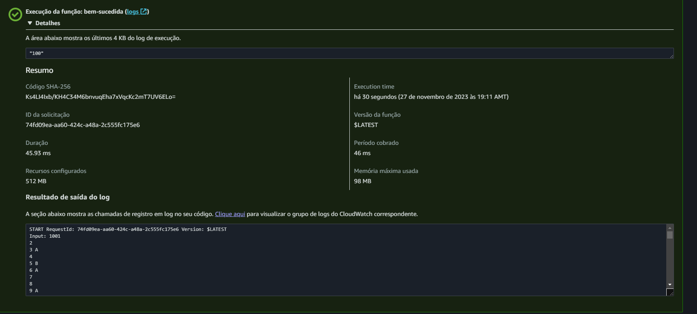
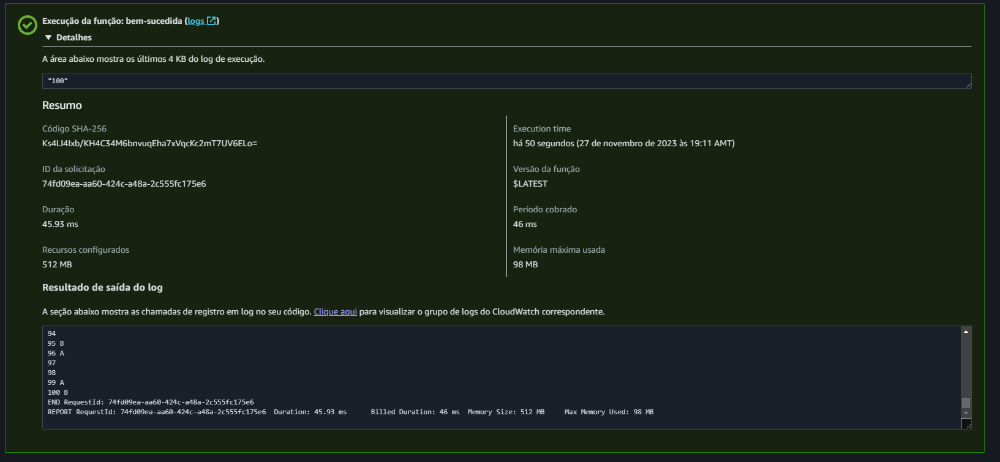

# Fizz Buss in Lambda Java 17

This is a Fizz Buzz project to learn Lambda using Pure Java 17

Print or Log in Lambda and also in Plain Old Java MAIN in console:

"A" for divisions by 3
"B" for divisions by 5
"C" for divisions by 3 AND 5

In Lambda create the same code but the input to the Lambda Function will be a number <= 150

I will try to set up AWS API Gateway to allow OPEN test of this Lambda.